# School District Analysis
An analysis of the "PyCity" school district's student performance as it relates to funding, school size, and school type using Pandas and ipython notebooks.

## Overview
This analysis will provide district executives key metrics of student performance based on past funding, school size, and school type to determine future funding. The key metrics that will be calculated are as follows:
- The District Summary
- The School Summary
- The Top Five Performing Schools Based On Overall Passing Rate
- The Bottom Five Performing Schools Based On Overall Passing Rate
- The Average Math Score For Each Grade level From Each School
- The Average Reading Score For Each Grade level From Each School
- The Scores By School Spending Per Student 
- The Scores By School Size
- The Scores By School Type

Additionally, this analysis will address the possibility of academic dishonesty at Thomas High School by their ninth graders. Their scores will be omitted and we will describe how these changes affected the overall analysis. 

## Results 
* How is the district summary affected?
  The original district summary here:
  
  
  
  The Revised District Summary here:
  
  
  
Removing the Thomas High School ninth grade scores has very little impact at the district level. Their scores have a minimal impact because they only represent roughly 1% of the total students.

* How is the school summary affected?
  The original school summary here:
  
  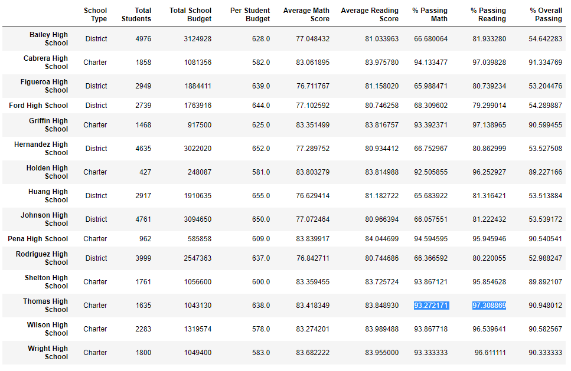
  
  The Revised School Summary here:
  
  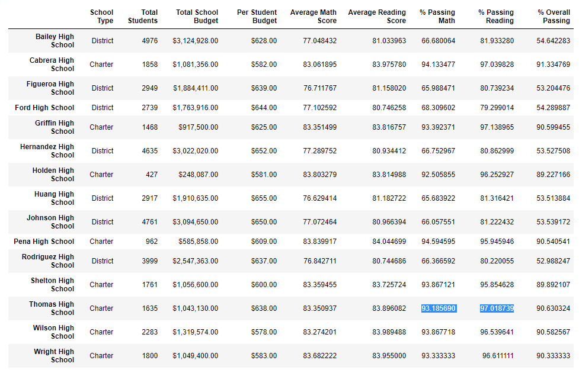
  
As highlighted above, the % passing math at Thomas High School drops by a minimal 0.09% Likewise the passing reading % of the school drops by 0.29% when the ninth graders scores are omitted. This would suggest the reported ninth grade scores are aligned with the performance expectations of the rest of the grades of Thomas High School.

* How does replacing the suspect data with NaN affect Thomas HS performance relative to other schools?

The Overall Passing % is hardly affected by replacing the suspect data. The percentage changes from 90.948012 to 90.630324, a minimal decrease of 0.32%. As highlighted below, Thomas High School remains the second highest performing school based on overall passing percentage. 

* How does replacing the suspect data with NaN affect the math and reading scores by grade?

Replacing the suspect date with NaN completely dismisses the Thomas High School ninth grade data for reading and math scores as highlighted below. The remaining schools and grades are unaffected. 

* Average Math Score By Grade Level:

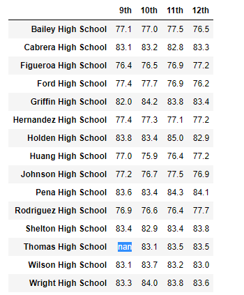

* Average Reading Score By Grade Level: 

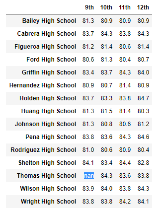

* How does replacing the suspect data with NaN affect scores by school spending?

As highlighted below, replacing the suspect data with NaN does minimally decrease the % passing for math, reading, and overall for the spending range (Per student) of $630-644. 

* The original scores by school spending:

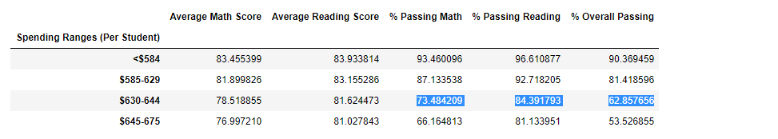

* The Revised scores by school spending:

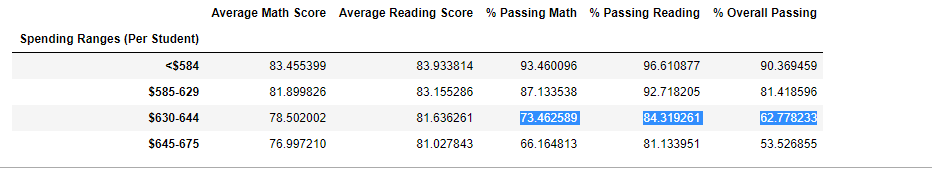

The decrease is so small that when industry standard formating is applied the change becomes negligible.

* The original and revised scores by school spending after formatting:

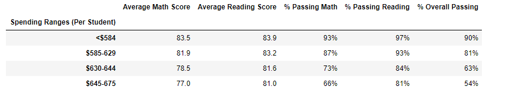

* How does replacing the suspect data with NaN affect scores by school size?

There is a slight decrease in scores and passing percentage for medium sized schools (1000-2000 students) when the suspect data is replaced with NaN as highlighted below.

* The original scores by school size:

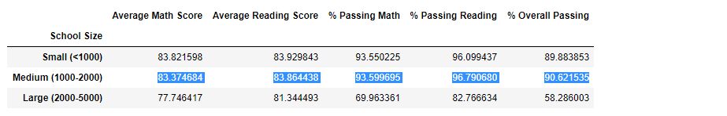

* The Revised scores by school size: 

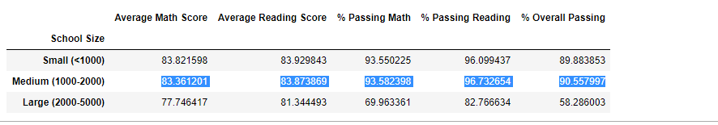

Akin to scores by school spending, the small decrease in scores and passing percentage by school size is negligible when industry standard formatting is applied. 

* The original and revised scores by school size after formatting:

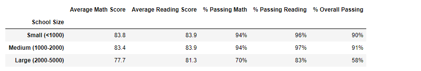

* How does replacing the suspect data with NaN affect scores by school type?

As expected, there is a minimal decrease in scores and passing percentage for the "Charter" school type when the suspect data is replaced with Nan as highlighted below. 

* The original scores by school type: 

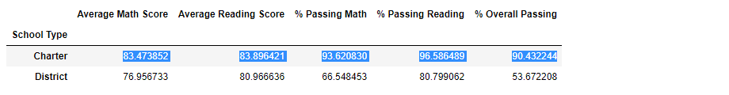

* The revised scores by school type: 

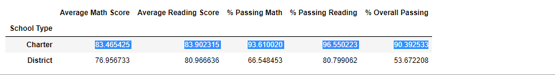

Similar to scores by school spending and size, when industry standard formatting is applied to the school type scores the decrease becomes negligible. 

* The original and revised scores by school type after formatting:

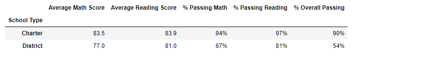

 

  

  

  
  
  

